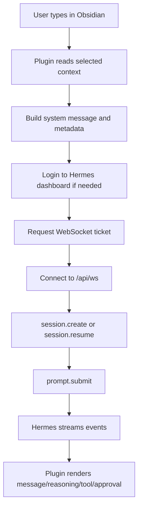

# Hermes Connection 개발 설명

이 문서는 `Hermes Connection` 플러그인의 작동 원리와 유지보수 포인트를 설명합니다.

대상 독자는 플러그인을 수정하거나, Hermes/Obsidian 업데이트 후 문제가 생겼을 때 원인을 추적해야 하는 개발자입니다.

## 1. 목표

`Hermes Connection`의 목표는 Obsidian을 Hermes 홈서버의 원격 채팅 클라이언트로 사용하는 것입니다.

핵심 설계:

```text
Obsidian plugin
  -> 채팅 UI
  -> 현재 노트/멘션/폴더 문맥 수집
  -> Hermes session API 또는 live gateway로 전송

Hermes server
  -> 모델 호출
  -> 도구 실행
  -> 파일 접근
  -> 터미널 실행
  -> 승인/거절 처리
```

플러그인은 컴퓨터 제어를 직접 구현하지 않습니다.  
`child_process`, 로컬 stdio ACP, Electron 전용 API는 기본 기능에서 제외하는 방향입니다.

이유:

- iPad/iPhone/Android에서는 로컬 프로세스 실행이 불가능합니다.
- Obsidian 모바일은 Node/Electron API에 의존할 수 없습니다.
- 원격 Hermes 서버가 실행 주체가 되어야 기기별 차이를 줄일 수 있습니다.

## 2. 주요 파일

```text
hermes-connection/
  manifest.json
  main.js
  styles.css
```

### manifest.json

Obsidian 플러그인 메타데이터입니다.

중요 필드:

```json
{
  "id": "hermes-connection",
  "name": "Hermes Connection",
  "isDesktopOnly": false
}
```

`isDesktopOnly: false`이므로 모바일 Obsidian도 고려해야 합니다.

### main.js

플러그인의 모든 런타임 로직이 들어 있습니다.

현재 배포본은 번들된 단일 JS 파일입니다. 유지보수를 쉽게 하려면 장기적으로 TypeScript 원본 구조를 복원하거나 새로 구성하는 것이 좋습니다.

주요 책임:

- Obsidian View 등록
- 설정 탭 생성
- Hermes 연결
- 모델 목록 로드
- 세션 목록 로드
- 메시지 전송
- live gateway WebSocket 연결
- streaming event 처리
- mention UI 처리
- Obsidian context 생성
- 승인/거절 UI 처리

### styles.css

채팅 UI, mention menu, thinking block, composer, toolbar 스타일입니다.

최근 UI 방향:

- 상단 버튼은 박스가 아니라 아이콘처럼 보이게 처리
- 입력창은 낮고 하단에 붙게 처리
- 전송 버튼도 배경 없는 아이콘 형태
- iPad/모바일 폭에서 공간 절약

## 3. 전체 동작 흐름



## 4. Hermes 통신 방식

### 4.1. Dashboard login

원격 dashboard 모드에서는 username/password를 사용합니다.

흐름:

```text
GET /api/auth/providers
POST /auth/password-login
POST /api/auth/ws-ticket
WebSocket /api/ws?ticket=...
```

플러그인은 Obsidian의 `requestUrl`을 사용해 HTTP 요청을 보냅니다.  
이 방식은 모바일에서 CORS/cookie 문제가 생길 가능성을 줄입니다.

주의:

- Hermes가 auth API 경로를 바꾸면 이 부분을 수정해야 합니다.
- password login provider 이름이 바뀌면 provider 선택 로직을 확인해야 합니다.
- 로그인 실패가 반복되면 Hermes가 429 rate limit을 줄 수 있습니다.

### 4.2. WebSocket live gateway

live gateway는 Hermes의 실시간 이벤트를 받기 위해 사용합니다.

주요 RPC:

```text
session.create
session.resume
prompt.submit
approval.respond
```

주요 이벤트:

```text
message.delta
message.complete
reasoning.delta
reasoning.available
thinking.delta
tool.start
tool.progress
tool.complete
approval.request
status.update
error
```

현재 플러그인 처리:

- `message.delta` -> assistant 답변
- `reasoning.delta`, `thinking.delta` -> thinking/reasoning 블록
- `reasoning.available` -> 무시
- `tool.*` -> 도구 로그
- `approval.request` -> 승인/거절 버튼
- `error` -> 에러 메시지

`reasoning.available`을 무시하는 이유:

일부 Hermes 이벤트에서는 최종 답변이 `message.delta`로 이미 온 뒤, 같은 내용이 `reasoning.available`로 다시 오는 경우가 있었습니다. 이를 thinking으로 렌더링하면 답변이 thinking 블록에 중복 표시됩니다.

Hermes 업데이트 후 답변/thinking 분리가 깨지면 event mapping을 먼저 확인해야 합니다.

## 5. 세션 동작

플러그인은 Hermes 세션을 가져오고 생성합니다.

기능:

- 세션 목록 불러오기
- 새 세션 만들기
- 기존 세션 선택
- 세션 드롭다운 클릭/포커스 시 조용히 동기화
- 주기적 동기화

주의:

- Hermes 앱에서 세션 rename/delete를 하면 플러그인 목록과 동기화되어야 합니다.
- 세션 드롭다운을 열 때마다 최신 목록을 가져오도록 구현되어 있습니다.
- Hermes API 응답 구조가 바뀌면 session parser를 수정해야 합니다.

## 6. 모델 목록 동작

원격 dashboard 모드에서 모델 목록은 Hermes dashboard의 모델 옵션 API를 사용합니다.

현재 방향:

```text
GET /api/model/options
```

그 뒤 provider/model 목록을 flatten해서 Obsidian 드롭다운에 표시합니다.

모델 id 내부 표현은 provider와 model을 함께 담기 위해 구분자를 사용합니다.

예:

```text
openai-codex\0gpt-5.5
nous\0some-model
custom:ollama-local\0gemma4:e2b-mlx
```

유지보수 포인트:

- Hermes 모델 옵션 API 구조가 바뀌면 listModels 로직 수정
- provider slug가 바뀌면 provider label 처리 수정
- visible model API가 공식 제공되면 현재 local storage 읽기 방식은 제거 가능

## 7. Mention 기능

mention 기능은 사용자가 채팅 입력창에서 Obsidian 문맥을 고르는 UI입니다.

현재 지원:

```text
Active Note
Notes
Folders
Vault
No Context
```

Copilot/Agent Client와 비슷한 사용감을 목표로 합니다.

### 7.1. Active Note

현재 보고 있는 Markdown 파일을 context로 선택합니다.

중요 요구:

현재 파일 선택 후 사용자가 보는 파일을 바꾸면, current file context도 따라가야 합니다.

이를 위해 플러그인은 Obsidian workspace 이벤트를 구독합니다.

```text
active-leaf-change
file-open
```

이 이벤트에서 마지막 active Markdown file path를 갱신하고, mention chip도 갱신합니다.

### 7.2. Notes

Vault의 Markdown 파일을 검색합니다.

검색 대상:

- basename
- vault-relative path

선택 시 내부 토큰은 대략 다음 형태입니다.

```text
@[[path/to/note.md|note]]
```

서버에 보낼 때는 파일 내용 일부와 metadata가 함께 구성됩니다.

### 7.3. Folders

폴더 mention은 파일 mention과 다릅니다.

작은 폴더:

- 폴더 내 Markdown 파일 목록 전달
- 일부 파일 내용 inline context로 전달

큰 폴더:

- 모든 내용을 프롬프트에 넣으면 비효율적
- 파일 목록과 metadata를 전달하고, 실제 검색은 Hermes의 RAG/MCP 도구를 쓰는 방향이 좋음

현재 구현은 폴더 안 Markdown 파일 목록을 최대 일정 개수까지 표시하고, 내용 첨부는 제한합니다.

## 8. Context Router 개념

이 플러그인의 context router는 사용자의 질문과 mention 상태를 보고 어떤 문맥을 Hermes에 보낼지 결정하는 계층입니다.

개념적 흐름:

```text
사용자 질문
  -> mention 분석
  -> 현재 파일/현재 폴더/폴더/노트/Vault 판별
  -> 크기 계산
  -> 작으면 inline context
  -> 크면 metadata + Hermes RAG/MCP 검색 유도
```

현재 inline context가 유리한 경우:

- 현재 파일
- 선택 영역
- 짧은 파일 mention
- 작은 폴더

RAG/MCP가 유리한 경우:

- Vault 전체
- 큰 폴더
- 긴 문서 다수
- PDF/코드/첨부파일 검색
- 최신 인덱스 기반 검색

장기적으로는 다음 구조가 가장 안정적입니다.

```text
Obsidian plugin
  -> active file and selected mentions inline
  -> large scope metadata

Hermes
  -> MCP RAG search
  -> tool execution
  -> answer generation
```

## 9. 파일 경로 정책

### 9.1. Vault 내부 경로

Vault 내부 파일은 기본적으로 vault-relative path를 사용합니다.

예:

```text
컴퓨터/언어/Assembly/예제/이항계수.md
```

장점:

- iCloud, NAS, Windows, macOS에서 Vault 루트가 달라도 의미 유지
- GitHub에 절대경로 노출 방지
- Obsidian API와 잘 맞음

### 9.2. 절대경로가 필요한 경우

Hermes 서버가 직접 filesystem tool로 읽어야 하는 경우 절대경로가 필요할 수 있습니다.

이때 플러그인은 metadata에 vault root hint를 함께 전달합니다.

예:

```text
vaultRoot: /Users/user/Library/Mobile Documents/iCloud~md~obsidian/Documents/컴퓨터
activeFile: 프로젝트/회의록.md
```

Hermes는 필요시 두 값을 결합합니다.

```text
vaultRoot + "/" + activeFile
```

주의:

모바일 Obsidian에서는 서버의 실제 파일 경로를 알 수 없습니다. iPad의 Vault 경로와 Mac Studio의 Vault 경로는 다릅니다. 따라서 플러그인에서 무조건 절대경로를 만들어 보내는 방식은 장기적으로 위험합니다.

### 9.3. Desktop / 바탕화면

사용자가 `바탕화면` 또는 `Desktop`이라고 말하면 이는 Obsidian Vault가 아니라 Hermes 서버 OS의 Desktop입니다.

현재 시스템 지시문은 다음 정책을 전달합니다.

```text
Desktop 또는 바탕화면은 process cwd가 아니라 Hermes server OS의 Desktop directory로 해석한다.
macOS/Linux는 보통 $HOME/Desktop.
Windows는 사용자 Desktop known folder.
애매하면 서버 도구로 확인한 뒤 쓴다.
```

이 정책은 특정 OS에 하드코딩하지 않기 위한 절충입니다.

## 10. Windows 이동 시 경로 문제

Windows에서는 다음 차이가 있습니다.

```text
macOS/Linux: /
Windows: \ 또는 /
Desktop: %USERPROFILE%\Desktop
드라이브: C:\Users\...
```

권장 유지보수 원칙:

1. Vault 내부 파일은 항상 vault-relative path로 유지
2. Obsidian API에는 `/` 기반 path 사용
3. Hermes 서버 도구 실행에는 서버 OS path를 사용
4. 플러그인에서 Windows 절대경로를 임의 조립하지 않기
5. 서버가 실제 파일 작업을 하기 전 `pwd`, home directory, Desktop known folder를 확인하도록 유도

문제가 생기는 대표 사례:

```text
사용자: 바탕화면에 파일 만들어줘
모델: 현재 작업 폴더에 파일 생성
```

대응:

- system message에서 Desktop 해석 규칙 강화
- Hermes tool layer에서 Desktop path helper 제공
- 가능하면 사용자가 명시한 위치를 서버에서 확인한 뒤 write 수행

## 11. iCloud/NAS 동기화 고려

플러그인은 Vault 안에 설치되므로 iCloud/NAS 동기화로 다른 기기에 전달될 수 있습니다.

장점:

- iPad에도 플러그인 파일과 설정이 동기화됨
- 별도 설치 과정이 줄어듦

주의:

- `data.json`도 동기화됩니다.
- username/password가 같이 넘어갈 수 있습니다.
- 여러 기기에서 동시에 설정을 바꾸면 충돌 파일이 생길 수 있습니다.
- NAS 경로는 macOS/Windows에서 다르게 mount될 수 있습니다.

권장:

- 개인 단독 사용이면 설정 동기화 허용 가능
- 공유 Vault라면 password 저장 방식을 다시 설계
- 공개 GitHub에는 `data.json` 제외

## 12. Obsidian 업데이트 시 점검할 것

Obsidian 업데이트 후 점검:

- `requestUrl` 동작 여부
- 모바일에서 WebSocket 연결 가능 여부
- `workspace.activeEditor.file` 접근 가능 여부
- `file-open`, `active-leaf-change` 이벤트 동작 여부
- `MarkdownView`, `TFile` type check 동작 여부
- SecretStorage API 동작 여부
- CSS 변수명 변경 여부

특히 모바일에서는 브라우저/Electron 차이가 있으므로 desktop에서만 되는 API를 쓰지 않도록 주의해야 합니다.

## 13. Hermes 업데이트 시 점검할 것

Hermes 업데이트 후 점검:

### 인증 API

확인:

```text
/api/auth/providers
/auth/password-login
/api/auth/ws-ticket
```

바뀌면 dashboard login flow 수정이 필요합니다.

### WebSocket API

확인:

```text
/api/ws?ticket=...
session.create
session.resume
prompt.submit
approval.respond
```

RPC method 이름이나 params가 바뀌면 live gateway 연결이 깨집니다.

### 이벤트 이름

확인:

```text
message.delta
message.complete
reasoning.delta
reasoning.available
tool.*
approval.request
```

이벤트 이름이 바뀌면 답변/thinking/tool/approval 표시가 깨질 수 있습니다.

### 모델 API

확인:

```text
/api/model/options
```

provider/model 구조가 바뀌면 모델 드롭다운이 실제 Hermes 앱과 달라질 수 있습니다.

### 세션 API

확인:

```text
/api/sessions
/api/sessions/{sessionId}/messages
```

rename/delete/list 동기화가 깨지면 session parser와 filter를 확인합니다.

## 14. 승인/거절 처리

Hermes가 위험하거나 변경이 필요한 작업을 하려면 approval event를 보낼 수 있습니다.

플러그인 처리 흐름:

```text
Hermes -> approval.request event
Plugin -> approval card render
User -> Approve / Reject click
Plugin -> approval.respond RPC
Hermes -> continue or cancel tool execution
```

유지보수 포인트:

- approval id가 session id와 어떻게 연결되는지 확인
- gateway approval과 REST approval fallback 구분
- 버튼이 안 뜨면 event mapping을 먼저 확인
- 버튼은 뜨는데 작업이 안 이어지면 `approval.respond` params 확인

## 15. Thinking UI

현재 thinking UI는 `<details>` 형태를 사용합니다.

목표:

- 생각 중일 때는 은은한 움직임
- 답변이 시작되면 자동으로 접힘
- 완료된 thinking은 애니메이션 중지
- 최종 답변이 thinking으로 중복 출력되지 않음

중요 처리:

```text
reasoning.available -> ignore
message.delta -> assistant message
reasoning.delta -> reasoning block
```

Hermes 이벤트 의미가 바뀌면 이 정책도 다시 검토해야 합니다.

## 16. 보안과 배포

GitHub에 포함할 파일:

```text
manifest.json
main.js
styles.css
사용방법.md
설명.md
```

GitHub에 포함하지 말 것:

```text
data.json
main.js.bak
.DS_Store
개인 Vault 파일
서버 토큰
dashboard password
```

권장 `.gitignore`:

```gitignore
data.json
*.bak
.DS_Store
```

## 17. 장기 개선 방향

### TypeScript 소스화

현재 `main.js`가 번들 결과물 중심이라 유지보수가 어렵습니다.

추천 구조:

```text
src/
  main.ts
  hermes-client.ts
  gateway-rpc.ts
  context-router.ts
  mention-menu.ts
  settings-tab.ts
  ui/
styles.css
manifest.json
```

### 공식 API 우선

현재 일부 정보는 Hermes 앱 local storage를 읽어 맞추는 방식이 포함되어 있습니다.

장기적으로는 Hermes가 다음 API를 제공하는 것이 가장 좋습니다.

```text
GET /api/model/visible
PUT /api/model/visible
GET /api/sessions
GET /api/session/{id}
```

공식 API가 생기면 local storage 추정 로직은 제거하는 것이 좋습니다.

### RAG-aware Context Router

큰 Vault를 다루려면 inline context만으로는 한계가 있습니다.

개선 방향:

```text
작은 문맥 -> inline context
큰 문맥 -> metadata + RAG/MCP search
```

Hermes가 MCP 검색 도구를 이미 연결하고 있다면, 플러그인은 사용자 의도를 metadata로 더 정확히 전달하고 Hermes가 검색 도구를 쓰도록 유도하면 됩니다.

### 플랫폼별 경로 helper

Desktop, Downloads, Documents 같은 OS known folder는 모델 프롬프트에만 맡기지 말고 Hermes tool layer에서 helper로 제공하는 것이 가장 안정적입니다.

예:

```text
resolve_known_folder("desktop")
resolve_known_folder("downloads")
```

이런 helper가 있으면 Windows/macOS/Linux 차이를 모델이 직접 추론하지 않아도 됩니다.

## 18. 빠른 회귀 테스트 체크리스트

릴리스 전 확인:

- Obsidian에서 플러그인 로드됨
- Settings 열림
- Test Connection 성공
- 모델 목록 로드됨
- 세션 목록 로드됨
- 새 세션 생성됨
- 기존 세션 선택됨
- 답변 스트리밍됨
- thinking과 답변이 분리됨
- 승인/거절 버튼 표시됨
- Active Note mention 동작
- 파일 변경 시 current file mention 갱신
- Notes 검색 동작
- Folders mention 동작
- iPad에서 Tailscale URL로 연결됨
- `data.json`이 GitHub에 포함되지 않음

