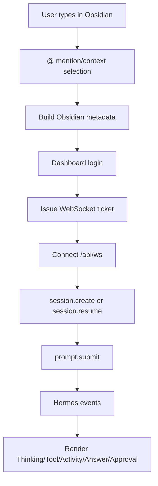

# Hermes Connection 개발 설명

이 문서는 `Hermes Connection` 플러그인의 개발자용 개요입니다.

상세 문서는 두 파일로 나누었습니다.

- [프론트엔드 UI/UX 설명](./설명-프론트엔드.md)
- [백엔드 로직/Hermes 통신 설명](./설명-백엔드로직.md)

## 1. 프로젝트 목표

`Hermes Connection`은 Obsidian을 Hermes 홈서버의 원격 채팅 클라이언트로 사용하기 위한 플러그인입니다.

핵심 역할 분리:

```text
Obsidian plugin
  -> 채팅 UI
  -> 세션/프로젝트 선택 UI
  -> @ mention UI
  -> Obsidian 문맥 metadata 구성
  -> Hermes로 메시지 전송
  -> Hermes 이벤트 렌더링

Hermes server
  -> 모델 호출
  -> 도구 실행
  -> 파일/터미널 접근
  -> 승인/거절 처리
  -> MCP/RAG 도구 호출
```

플러그인은 컴퓨터 제어를 직접 구현하지 않습니다. 모바일 호환성을 위해 기본 기능에서 `child_process`, 로컬 stdio ACP, 데스크톱 전용 Electron API를 사용하지 않는 방향입니다.

## 2. 주요 파일

```text
hermes-connection/
  manifest.json
  main.js
  styles.css
```

### manifest.json

Obsidian 플러그인 메타데이터입니다.

```json
{
  "id": "hermes-connection",
  "name": "Hermes Connection",
  "isDesktopOnly": false
}
```

`isDesktopOnly: false`이므로 모바일 Obsidian도 고려해야 합니다.

### main.js

현재 배포본은 번들된 단일 JS 파일입니다.

주요 책임:

- Obsidian View 등록
- 설정 탭 생성
- Hermes dashboard 로그인
- WebSocket ticket 발급
- live WebSocket 연결
- 모델/세션/프로젝트 목록 로드
- 메시지 전송
- streaming event 처리
- mention UI 처리
- Obsidian context 생성
- 승인/거절 UI 처리
- History modal 및 세션 검색/삭제

장기 유지보수 관점에서는 TypeScript 원본 구조를 복원하거나 새로 구성하는 것이 좋습니다.

### styles.css

채팅 화면 전체 UI를 담당합니다.

주요 영역:

- 상단 toolbar
- project/session select
- History modal
- chat log
- assistant/user bubble
- Thinking/Activity/Tool block
- mention menu
- composer
- mobile responsive layout

## 3. 전체 흐름



## 4. 문서 분리 기준

### 프론트엔드 문서

[설명-프론트엔드.md](./설명-프론트엔드.md)

다음 내용을 다룹니다.

- 채팅 UI 구조
- 상단 프로젝트/세션 드롭다운
- History modal
- 세션 검색 UI
- mention UI
- composer
- Thinking/Activity/Tool 렌더링
- Markdown 렌더링과 답변 복사
- 모바일/iPad UI 고려사항

### 백엔드 로직 문서

[설명-백엔드로직.md](./설명-백엔드로직.md)

다음 내용을 다룹니다.

- Hermes dashboard auth
- WebSocket ticket
- live WebSocket RPC
- session create/resume/delete
- model loading
- project/session sync
- search API
- Obsidian context metadata
- RAG/docsearch-mcp hint
- 승인/거절
- 유지보수 포인트

## 5. 업데이트 시 주의할 점

Hermes 업데이트 시 먼저 확인할 것:

- `/api/auth/providers`
- `/auth/password-login`
- `/api/auth/ws-ticket`
- `/api/ws`
- `/api/sessions`
- `/api/sessions/search`
- `/api/model/options`
- WebSocket RPC method 이름
- live event type 이름

Obsidian 업데이트 시 먼저 확인할 것:

- `requestUrl`
- `MarkdownRenderer.renderMarkdown`
- `MarkdownView`
- `workspace` 이벤트
- 모바일에서 사용 가능한 API 범위

## 6. 배포 전 체크리스트

```bash
node --check hermes-connection/main.js
git diff --check
git status --short
```

확인할 것:

- `data.json`이 커밋되지 않았는지
- `main.js`, `styles.css`, `manifest.json`이 최신인지
- Obsidian 재시작 후 UI가 실제로 반영되는지
- Hermes dashboard 서버가 켜져 있는지
- Tailscale/iPad 접속 URL이 `127.0.0.1`이 아닌지

## 7. 현재 설계 원칙

- Obsidian은 UI와 문맥 전달에 집중한다.
- 실제 작업은 Hermes 서버가 한다.
- Vault 경로는 기본적으로 vault-relative metadata로 보낸다.
- 큰 폴더/Vault 전체 질문은 내용을 모두 붙이지 않고 RAG/search 힌트를 보낸다.
- UI는 박스형 버튼을 줄이고 아이콘 중심으로 유지한다.
- 완료된 Thinking/Activity에는 진행 중 애니메이션을 남기지 않는다.
- 세션 삭제는 실제 Hermes 삭제이므로 확인창과 active session 보호를 둔다.
